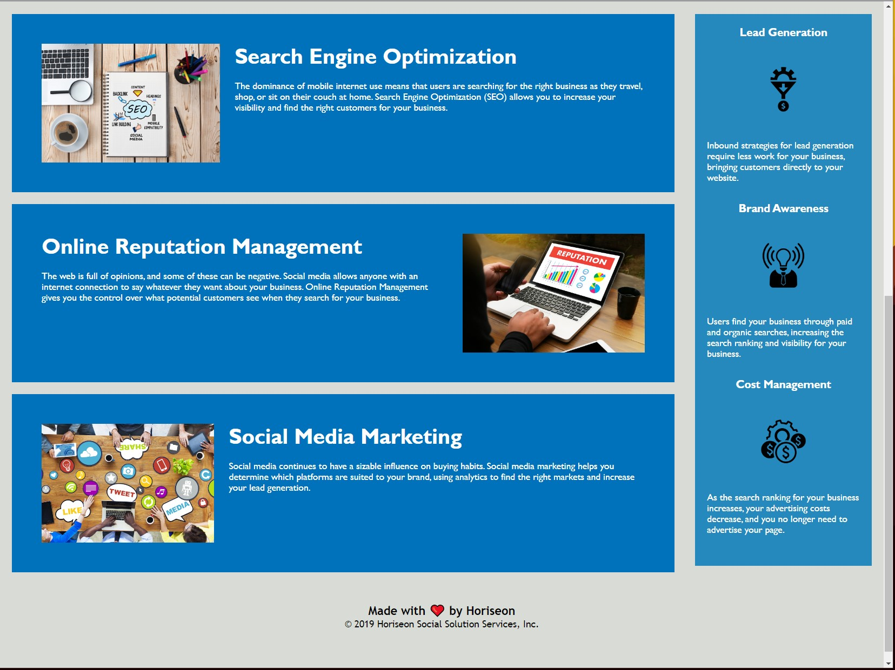

# code_refactor
This is a homework assignemnt to clean up and update the site for accessability and optimizing both the html and css code. 

CSS was consolidated to use semantic tags instead of many different class and id tags. 

html file was formatted with proper indentation and structure with updated semantic tags

Screenshots

